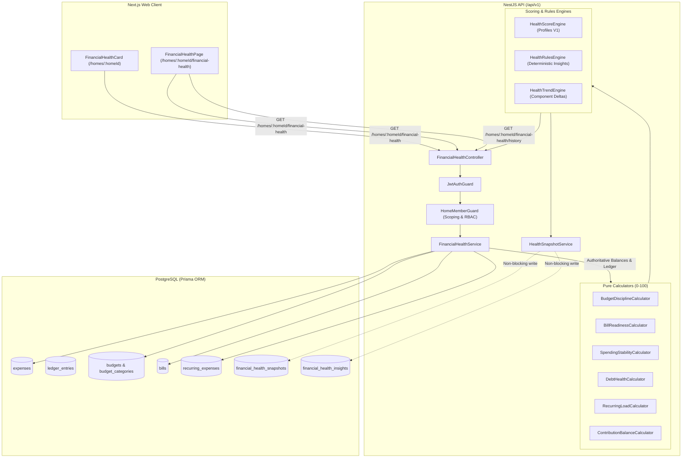

# Financial Health Engine — Architecture Specification

**Document Version:** 1.0.0  
**Feature:** #1 — Khaarchi Financial Health Engine  
**Layer:** Backend Domain / NestJS Modular Monolith / Next.js Web  

---

## 1. Component Architecture & Data Flow

---

## 2. Dependencies & Subsystems

1. **`BalancesService`**: Authoritative double-entry debt calculations, pairwise netting, and zero-sum invariant assertions. Reused directly without recalculating or duplicating ledger math.
2. **`HomeMemberGuard`**: Enforces tenant-isolation boundary. Blocks cross-home queries, unauthenticated sessions, and deactivated members.
3. **`PrismaService`**: Managed PostgreSQL transactions and bounded temporal queries.
4. **`packages/financial-core`**: Core math functions (`toCents`, `toMajor`, `roundFinancial`) ensuring zero floating-point accumulation.

---

## 3. Security & Multi-Tenancy Threat Model

| Threat | Vulnerability Vector | Defense Mechanism | Verified In |
| :--- | :--- | :--- | :--- |
| **Cross-Tenant Access** | Caller queries `GET /homes/:foreignId/financial-health` | `HomeMemberGuard` queries `home_members` by `(homeId, userId, isActive)`. Rejects non-members with `403 Forbidden`. | `financial-health.controller.spec.ts` |
| **Score Tampering** | Client attempts to supply score in body or headers | Endpoint is strictly `GET`. Server reads database truth and calculates score entirely server-side. | `financial-health.controller.ts` |
| **Unauthenticated Snooping** | Missing or expired JWT token | `JwtAuthGuard` rejects before guard evaluation with `401 Unauthorized`. | `financial-health.controller.spec.ts` |
| **Stale Member Access** | Deactivated member queries historic home data | `HomeMemberGuard` explicitly asserts `member.isActive === true`. | `financial-health.controller.spec.ts` |
| **Information Leakage** | Exceptions dump raw database connection strings or schemas | Handled by NestJS `AllExceptionsFilter` stripping stack traces in production. | `apps/api/src/common/filters` |

---

## 4. Performance & Query Efficiency

1. **Bounded Historical Windows**: Historical spending stability queries are bounded to `[targetMonthStart, targetMonthEnd]` for the past 3 months.
2. **Database Aggregations**: Queries use PostgreSQL native `_sum` and `_count` aggregations instead of loading full expense rows into Node.js heap memory.
3. **Concurrent Parallel I/O**: Expenses, budgets, bills, recurring rules, and balances are retrieved concurrently using `Promise.all`.
4. **Asynchronous Snapshot Recording**: Persisting analytical snapshots (`financial_health_snapshots`) executes as a non-blocking asynchronous task; slow snapshot writes never delay the user response.

---

## 5. Failure Modes & Reliability

| Failure Mode | Behavior | Recovery / UX |
| :--- | :--- | :--- |
| **Zero Historical Months** | Spending stability returns `null` score with `INSUFFICIENT` sufficiency. | Score engine re-normalizes active weights; UI displays "Building Profile". |
| **No Budget Defined** | Budget discipline returns `null` score with `INSUFFICIENT` sufficiency. | Score engine dynamically re-normalizes remaining active dimensions. |
| **Snapshot Table Write Failure** | Logged to console as an error. | Evaluated health payload is returned successfully to client (read integrity preserved). |
| **Network Failure on Client** | React Query catches failure. | User sees actionable retry modal with link back to household. |
