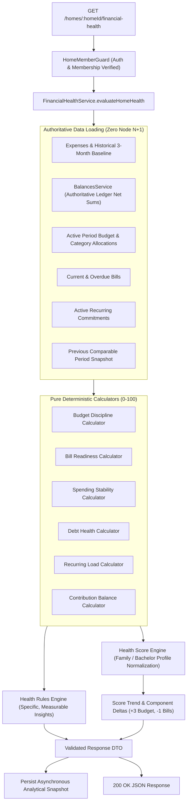

# Financial Health Engine: Architecture & Integration Analysis

**Document Version:** 1.0.0  
**Status:** Approved for Implementation  
**Feature:** #1 — Khaarchi Financial Health Engine  
**Author:** Principal Engineer, Product Architect, Financial Systems Engineer  

---

## 1. Executive Architecture Findings

The Khaarchi codebase is structured as a pnpm monorepo governed by strict double-entry arithmetic invariants, PostgreSQL multi-tenancy, and separation of concerns between core mathematical abstractions and API orchestration.

### Current Architecture Map
- **Monorepo Workspaces (`pnpm-workspace.yaml`)**:
  - `packages/financial-core`: Pure TypeScript, zero external dependencies. Contains fundamental financial math (`toCents`, `toMajor`, `roundFinancial`), split algorithms (`calculateEqualSplits`, `calculatePercentageSplits`, `calculateSharesSplits`), debt minimization (`simplifyDebts`), and invariant assertions (`validateExpenseSplits`, `validateZeroSumLedger`, `validateSettlementAmount`).
  - `packages/database`: Prisma ORM client v6.19.3 mapping to PostgreSQL with connection pooling.
  - `packages/validation`: Zod schemas for runtime payload validation.
  - `packages/types`: Universal TypeScript domain interfaces.
  - `packages/shared`: Shared exports unifying math, invariants, schemas, and enums.
  - `packages/ui`: Design tokens (slate/terracotta/emerald palette matching equilibrium guidelines).
  - `apps/api`: NestJS 11 modular monolith with JWT authentication, role-based access control, home membership guards (`HomeMemberGuard`), global exception filters, and OpenAPI/Swagger documentation.
  - `apps/web`: Next.js 15 (App Router, React 19) with TanStack React Query, Lucide icons, and Tailwind CSS.

### Invariant & Integrity Baseline
1. **Ledger Integrity**: PostgreSQL is the immutable source of truth. Every expense and settlement produces balancing records in `ledger_entries`.
2. **Deterministic Arithmetic**: Floating-point drift is strictly barred. Cents integer conversion (`Math.round(amount * 100)`) is used for intermediate calculations, with `toMajor(cents)` converting back to 2 decimal places.
3. **Multi-Tenancy & Authorization**: Every tenant entity is explicitly scoped by `homeId`. Route-level security is enforced by `JwtAuthGuard` + `HomeMemberGuard`. `HomeMemberGuard` verifies that the caller has an active `HomeMember` record for `homeId`. Object-level security guards sensitive operations (e.g. payer/admin ownership).

---

## 2. Reusable Services, Queries, & Core Functions

| Domain | Entity / Service | Location | Reusable Capability |
| :--- | :--- | :--- | :--- |
| **Balances & Ledger** | `BalancesService.getHomeBalances` | `apps/api/src/balances/balances.service.ts` | Calculates exact net member balances, pairwise debts, zero-sum invariant check, and simplified debt graph. |
| **Financial Math** | `toCents`, `toMajor`, `roundFinancial` | `packages/financial-core/src/math.ts` | Integer-cent arithmetic and deterministic 2-decimal formatting. |
| **Debt Simplification** | `simplifyDebts` | `packages/financial-core/src/math.ts` | Minimum-cash-flow algorithm reducing pairwise debts to minimal settlements. |
| **Expense Aggregation** | `prisma.expense.aggregate` | `packages/database` | Bounded period expenditure sums and counts without loading raw records into Node memory. |
| **Authorization Guard** | `HomeMemberGuard` | `apps/api/src/homes/guards/home-member.guard.ts` | Validates active household membership and attaches `req.member` and `req.home`. |
| **Web API Client** | `apiClient` | `apps/web/src/lib/api-client.ts` | Automatic bearer token attachment, 401 interceptor, and unified error handling. |

---

## 3. Missing Capabilities & Identified Gaps

To calculate a comprehensive 6-dimension household health score:
1. **Budgets Persistence**: While `CreateBudgetSchema` exists in validation and is documented in PRD/architecture, Prisma schema does not yet define `Budget` and `BudgetCategory` models.
2. **Bills Persistence**: While `CreateBillSchema` exists in validation, Prisma schema does not yet define the `Bill` model.
3. **Recurring Expenses Persistence**: While `CreateRecurringExpenseSchema` exists in validation, Prisma schema does not yet define `RecurringExpense`.
4. **Health Snapshots & Insights Tables**: No historical analytical snapshot or insight storage currently exists.
5. **Data Sufficiency Handling**: Households that are newly created or lack budgets/bills must not receive an artificial `0/100` "CRITICAL" score. A robust sufficiency model (`INSUFFICIENT`, `PARTIAL`, `FULL`) with dynamic profile weight re-normalization is essential.
6. **Contribution Balance Policy**: The current data model does not track individual member income or off-platform pooled savings. In alignment with Section 16, Khaarchi must NOT fabricate fake income data; Contribution Balance will report `NOT_AVAILABLE` when authoritative contribution targets are unset, and the engine will dynamically normalize remaining weights deterministically.

---

## 4. Proposed Schema Additions

To support authoritative financial health analysis without duplicating financial truth, the following models will be introduced into `packages/database/prisma/schema.prisma`:

### A. Authoritative Financial Tables
```prisma
enum BillStatus {
  UNPAID
  PAID
  OVERDUE
}

enum RecurringInterval {
  DAILY
  WEEKLY
  MONTHLY
  YEARLY
}

model Budget {
  id          String           @id @default(uuid()) @db.Uuid
  homeId      String           @db.Uuid
  month       Int
  year        Int
  totalBudget Decimal          @db.Decimal(12, 2)
  createdAt   DateTime         @default(now())
  updatedAt   DateTime         @updatedAt

  home        Home             @relation(fields: [homeId], references: [id], onDelete: Cascade)
  categories  BudgetCategory[]

  @@unique([homeId, year, month])
  @@index([homeId])
  @@map("budgets")
}

model BudgetCategory {
  id              String          @id @default(uuid()) @db.Uuid
  budgetId        String          @db.Uuid
  category        ExpenseCategory
  allocatedAmount Decimal         @db.Decimal(12, 2)
  createdAt       DateTime        @default(now())
  updatedAt       DateTime        @updatedAt

  budget          Budget          @relation(fields: [budgetId], references: [id], onDelete: Cascade)

  @@unique([budgetId, category])
  @@index([budgetId])
  @@map("budget_categories")
}

model Bill {
  id              String     @id @default(uuid()) @db.Uuid
  homeId          String     @db.Uuid
  title           String     @db.VarChar(150)
  amount          Decimal    @db.Decimal(12, 2)
  dueDate         DateTime
  status          BillStatus @default(UNPAID)
  billDocumentUrl String?
  createdAt       DateTime   @default(now())
  updatedAt       DateTime   @updatedAt

  home            Home       @relation(fields: [homeId], references: [id], onDelete: Cascade)

  @@index([homeId, dueDate])
  @@index([homeId, status])
  @@map("bills")
}

model RecurringExpense {
  id            String            @id @default(uuid()) @db.Uuid
  homeId        String            @db.Uuid
  payerMemberId String            @db.Uuid
  amount        Decimal           @db.Decimal(12, 2)
  description   String            @db.VarChar(255)
  category      ExpenseCategory
  interval      RecurringInterval @default(MONTHLY)
  nextRunAt     DateTime
  splitType     SplitType         @default(EQUAL)
  active        Boolean           @default(true)
  createdAt     DateTime          @default(now())
  updatedAt     DateTime          @updatedAt

  home          Home              @relation(fields: [homeId], references: [id], onDelete: Cascade)
  payer         HomeMember        @relation(fields: [payerMemberId], references: [id], onDelete: Restrict)

  @@index([homeId, active])
  @@index([homeId, nextRunAt])
  @@map("recurring_expenses")
}
```

### B. Health Snapshot & Insights Storage
```prisma
enum HealthStatus {
  EXCELLENT
  HEALTHY
  WATCH
  AT_RISK
  CRITICAL
  BUILDING_PROFILE
}

enum InsightSeverity {
  CRITICAL
  WARNING
  INFO
  POSITIVE
}

enum DataSufficiency {
  FULL
  PARTIAL
  INSUFFICIENT
}

model FinancialHealthSnapshot {
  id              String          @id @default(uuid()) @db.Uuid
  homeId          String          @db.Uuid
  periodStart     DateTime
  periodEnd       DateTime
  score           Int?
  status          HealthStatus
  scoringVersion  String          @db.VarChar(50)
  profile         HomeType
  dataSufficiency DataSufficiency
  dimensionScores Json
  metrics         Json
  createdAt       DateTime        @default(now())

  home            Home            @relation(fields: [homeId], references: [id], onDelete: Cascade)

  @@index([homeId, createdAt])
  @@index([homeId, periodStart, periodEnd])
  @@map("financial_health_snapshots")
}

model FinancialHealthInsight {
  id             String          @id @default(uuid()) @db.Uuid
  homeId         String          @db.Uuid
  type           String          @db.VarChar(50)
  severity       InsightSeverity
  title          String          @db.VarChar(200)
  description    String          @db.Text
  affectedDomain String          @db.VarChar(50)
  metricValue    Decimal?        @db.Decimal(12, 2)
  thresholdValue Decimal?        @db.Decimal(12, 2)
  entityType     String?         @db.VarChar(50)
  entityId       String?         @db.Uuid
  status         String          @default("ACTIVE") @db.VarChar(20)
  scoringVersion String          @db.VarChar(50)
  createdAt      DateTime        @default(now())
  resolvedAt     DateTime?

  home           Home            @relation(fields: [homeId], references: [id], onDelete: Cascade)

  @@index([homeId, status])
  @@index([homeId, createdAt])
  @@map("financial_health_insights")
}
```

---

## 5. Proposed Backend Architecture (`FinancialHealthModule`)

A dedicated domain at `apps/api/src/financial-health` adhering to NestJS standards:

```text
apps/api/src/financial-health/
├── financial-health.module.ts
├── financial-health.controller.ts
├── financial-health.service.ts
├── calculators/
│   ├── budget-discipline.calculator.ts
│   ├── bill-readiness.calculator.ts
│   ├── spending-stability.calculator.ts
│   ├── debt-health.calculator.ts
│   ├── recurring-load.calculator.ts
│   └── contribution-balance.calculator.ts
├── rules/
│   ├── health-rules.engine.ts
│   └── rule-definitions.ts
├── scoring/
│   ├── health-score.engine.ts
│   ├── scoring-profiles.ts
│   └── health-status.mapper.ts
├── snapshots/
│   └── health-snapshot.service.ts
└── types/
    └── financial-health.types.ts
```

### Deterministic Calculation Flow


---

## 6. Scoring Profiles & Deterministic Weights

### Version: `FINANCIAL_HEALTH_V1`

#### Family Mode Profile (`HEALTH_SCORE_PROFILE_V1_FAMILY`)
- Budget Discipline: **25%**
- Bill Readiness: **20%**
- Spending Stability: **20%**
- Contribution Balance: **15%** (If authoritative data is missing, weight is dynamically reallocated proportionally across remaining available dimensions)
- Recurring Load: **10%**
- Debt Health: **10%**
- Total: **100%**

#### Bachelor Mode Profile (`HEALTH_SCORE_PROFILE_V1_BACHELOR`)
- Debt Health: **30%**
- Spending Stability: **20%**
- Budget Discipline: **20%**
- Recurring Load: **15%**
- Bill Readiness: **15%**
- Contribution Balance: **0%** (N/A)
- Total: **100%**

### Dimension Formulas
1. **Budget Discipline**:
   - `utilization = totalSpent / totalBudget`
   - If `utilization <= 0.80`: Score = 100
   - If `0.80 < utilization <= 1.00`: Linear decay from 100 down to 70
   - If `1.00 < utilization <= 1.25`: Linear decay from 70 down to 20
   - If `utilization > 1.25`: Score = 0
   - Category budget overruns apply up to -10 penalty.
   - If no budget set: Sufficiency = `PARTIAL`; weight re-allocated to available dimensions.
2. **Bill Readiness**:
   - Overdue bills: Severe penalty (-35 per overdue bill, floor 0).
   - Upcoming unpaid bills due in $\le 7$ days: Monitored (-10 per bill without coverage).
   - All bills paid on time: Score = 100.
   - If no bills exist: Dimension reports `NO_OBLIGATIONS` (Score = 100 or omitted from weighting).
3. **Spending Stability**:
   - Historical baseline: 3 completed comparable monthly periods.
   - Current spend normalized by month progress ratio: `normalizedSpend = currentSpend / (currentDay / daysInMonth)`.
   - `deviation = (normalizedSpend - baselineAvg) / baselineAvg`.
   - Deviation within $\pm 10\%$: Score = 100.
   - Deviation $+10\%$ to $+30\%$: Score = 75.
   - Deviation $+30\%$ to $+50\%$: Score = 50.
   - Deviation $> +50\%$: Score = 20.
   - If insufficient history (< 1 month): Sufficiency = `PARTIAL`, Baseline note generated.
4. **Debt Health** (Reuses `BalancesService`):
   - `unsettledRatio = totalOutstandingDebt / totalHouseholdSpend`.
   - Zero unsettled debt: Score = 100.
   - Low debt ratio ($< 20\%$): Score = 90.
   - Moderate ($20\% - 50\%$): Score = 70.
   - High ($> 50\%$): Score = 40.
5. **Recurring Load**:
   - `committedRatio = recurringMonthlyAmount / baselineMonthlySpend`.
   - Flexible commitments ($< 30\%$): Score = 100.
   - Moderate ($30\% - 50\%$): Score = 80.
   - Heavy commitment ($50\% - 70\%$): Score = 50.
   - Inflexible ($> 70\%$): Score = 25.
6. **Contribution Balance**:
   - Evaluates whether active members are contributing in alignment with agreed shares/splits.
   - Returns `NOT_AVAILABLE` if no contribution targets exist, triggering deterministic weight redistribution.

### Health Status Map
- `90 - 100`: **EXCELLENT**
- `75 - 89`: **HEALTHY**
- `60 - 74`: **WATCH**
- `40 - 59`: **AT_RISK**
- `0 - 39`: **CRITICAL**
- Insufficient activity: **BUILDING_PROFILE**

---

## 7. API Specification

### Endpoint: `GET /api/v1/homes/:homeId/financial-health`
- **Guards**: `JwtAuthGuard`, `HomeMemberGuard`
- **Output Schema**:
```json
{
  "score": 83,
  "status": "HEALTHY",
  "scoringVersion": "FINANCIAL_HEALTH_V1",
  "profile": "FAMILY",
  "confidence": "HIGH",
  "dataSufficiency": "FULL",
  "period": {
    "start": "2026-10-01T00:00:00.000Z",
    "end": "2026-10-31T23:59:59.999Z"
  },
  "trend": {
    "current": 83,
    "previous": 78,
    "change": 5,
    "direction": "UP",
    "componentDeltas": [
      { "dimension": "BUDGET_DISCIPLINE", "delta": 3, "label": "Budget discipline improved" },
      { "dimension": "BILL_READINESS", "delta": 2, "label": "Bills became current" }
    ]
  },
  "breakdown": [
    {
      "key": "BUDGET_DISCIPLINE",
      "label": "Budget Discipline",
      "score": 76,
      "weight": 0.25,
      "weightedContribution": 19.0,
      "status": "HEALTHY",
      "sufficiency": "FULL",
      "explanation": "84% of the monthly ₹50,000 budget used with 12 days remaining.",
      "metrics": {
        "budgetTotal": 50000.0,
        "spentTotal": 42000.0,
        "utilizationPercentage": 84.0
      }
    }
  ],
  "strengths": [
    { "title": "Zero Overdue Bills", "description": "All scheduled utility and household obligations are current." }
  ],
  "risks": [
    { "title": "Groceries Near Limit", "description": "Groceries category has reached 91% of its ₹12,000 allocation." }
  ],
  "insights": [
    {
      "type": "BUDGET_WARNING",
      "severity": "WARNING",
      "title": "Groceries category near limit",
      "description": "Groceries has reached 91% of its allocated ₹12,000 monthly envelope.",
      "affectedDomain": "BUDGET",
      "metricValue": 91.0,
      "thresholdValue": 85.0
    }
  ]
}
```

---

## 8. Frontend Integration Plan

### A. Dashboard Health Card (`apps/web/src/app/homes/[homeId]/page.tsx`)
- Placed prominently above the ledger streams.
- Displays:
  - Big bold score (e.g. 83) & status badge (`HEALTHY` in emerald / `WATCH` in amber / `CRITICAL` in terracotta).
  - Micro trend indicator: `↑ +5 from last month`.
  - Dimension preview bar: 4 quick metric gauges (Budget, Bills, Stability, Debt).
  - Actionable signal count: `1 thing needs attention`.
  - Link button: `View Financial Health →` directing to `/homes/:homeId/financial-health`.
  - Seamless support for `BUILDING_PROFILE` with educational onboarding checklist.

### B. Dedicated Financial Health Page (`apps/web/src/app/homes/[homeId]/financial-health/page.tsx`)
- Full page layout with:
  1. Header with breadcrumb and Household mode context (Bachelor Flat vs Family Household).
  2. Score Hero card with KaTeX/SVG score ring, status badge, confidence level, and trend change explanation.
  3. Dimension Breakdown Grid with interactive progress bars, metric transparency, and mathematical contribution formula.
  4. Risk & Insight Center with severity tags (`CRITICAL`, `WARNING`, `INFO`), specific rupee amounts, and actionable navigation buttons.
  5. Historical Trend & Snapshot timeline.
  6. Data Sufficiency banner explaining exactly what data points were used and what can be added to improve score accuracy.

---

## 9. Risk Analysis & Mitigations

| Risk | Impact | Mitigation |
| :--- | :--- | :--- |
| **New Household Cold Start** | Score misleads user with a false "0/100 Critical". | Implemented `BUILDING_PROFILE` state when data sufficiency is `INSUFFICIENT`. Score renders as building with onboarding guidance. |
| **Floating Point Score Inconsistencies** | Score fluctuates or test assertions fail across Node/V8 environments. | All currency arithmetic strictly uses integer cents (`toCents`, `toMajor`). Score calculations use deterministic `Math.round`. |
| **Cross-Tenant Information Leakage** | Malicious user queries another home's financial health. | `HomeMemberGuard` strictly validates active user membership for `homeId`. Unauthenticated or non-member queries return `403 Forbidden`. |
| **Performance Overhead on Large Ledgers** | Ledger aggregations cause request timeouts. | Queries use PostgreSQL `aggregate` and `count` scoped to bounded monthly date ranges. No unbounded raw arrays loaded into memory. |
| **Unexplainable Score Shifts** | User feels score is arbitrary or AI-hallucinated. | Component deltas are calculated strictly from previous analytical snapshots with deterministic mathematical differentials. |

---

## 10. Step-by-Step Implementation Sequence

1. **Phase 2 & 3: Database Schema & Migration**
   - Update `packages/database/prisma/schema.prisma` with `Budget`, `BudgetCategory`, `Bill`, `RecurringExpense`, `FinancialHealthSnapshot`, and `FinancialHealthInsight`.
   - Push schema to database and generate updated Prisma client.
   - Run type checks and build verification.
2. **Phase 4: Core Domain Calculators**
   - Implement `BudgetDisciplineCalculator`, `BillReadinessCalculator`, `SpendingStabilityCalculator`, `DebtHealthCalculator`, `RecurringLoadCalculator`, and `ContributionBalanceCalculator` in `apps/api/src/financial-health/calculators`.
   - Write comprehensive unit tests for each calculator under edge cases.
3. **Phase 5 & 6: Scoring & Rules Engines**
   - Implement `HealthScoreEngine`, `ScoringProfiles` (`FAMILY` vs `BACHELOR`), and `HealthRulesEngine`.
   - Write property/invariant tests and profile selection tests.
4. **Phase 7: API Controller, Service, & Authorization**
   - Implement `FinancialHealthService`, `FinancialHealthController`, and `FinancialHealthModule`.
   - Wire up `HomeMemberGuard` and register in `AppModule`.
   - Write integration and authorization tests.
5. **Phase 8: Frontend Dashboard Card**
   - Add responsive Financial Health card in `apps/web/src/app/homes/[homeId]/page.tsx`.
6. **Phase 9: Dedicated Full Financial Health Page**
   - Create `apps/web/src/app/homes/[homeId]/financial-health/page.tsx` with all 10 required sections, accessible states, and mobile responsiveness.
7. **Phase 10: Snapshot Persistence & Trend History**
   - Implement analytical snapshot creation and historical trend comparisons.
8. **Phase 11 & 12: Documentation, Full Verification, & Audit**
   - Complete documentation suite.
   - Run full unit, integration, lint, and production build checks.
   - Hostile security audit before final sign-off.
