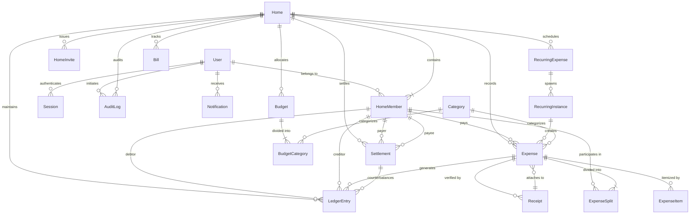

# Entity Relationship Diagram (ERD)
## HomeExpense — Relational Data Architecture

```mermaid
erDiagram
    User ||--o{ HomeMember : "belongs to"
    User ||--o{ Session : "authenticates"
    User ||--o{ AuditLog : "initiates"
    User ||--o{ Notification : "receives"

    Home ||--|{ HomeMember : "contains"
    Home ||--o{ HomeInvite : "issues"
    Home ||--o{ Expense : "records"
    Home ||--o{ LedgerEntry : "maintains"
    Home ||--o{ Settlement : "settles"
    Home ||--o{ RecurringExpense : "schedules"
    Home ||--o{ Bill : "tracks"
    Home ||--o{ Budget : "allocates"
    Home ||--o{ AuditLog : "audits"

    HomeMember ||--o{ Expense : "pays"
    HomeMember ||--o{ ExpenseSplit : "participates in"
    HomeMember ||--o{ LedgerEntry : "debtor"
    HomeMember ||--o{ LedgerEntry : "creditor"
    HomeMember ||--o{ Settlement : "payer"
    HomeMember ||--o{ Settlement : "payee"

    Expense ||--|{ ExpenseSplit : "divided into"
    Expense ||--o{ ExpenseItem : "itemized by"
    Expense ||--o{ LedgerEntry : "generates"
    Expense ||--o{ Receipt : "verified by"

    Settlement ||--o{ LedgerEntry : "counterbalances"

    RecurringExpense ||--o{ RecurringInstance : "spawns"
    RecurringInstance ||--o{ Expense : "creates"

    Budget ||--|{ BudgetCategory : "divided into"
    Category ||--o{ BudgetCategory : "categorizes"
    Category ||--o{ Expense : "categorizes"

    Receipt ||--o{ Expense : "attaches to"
```
