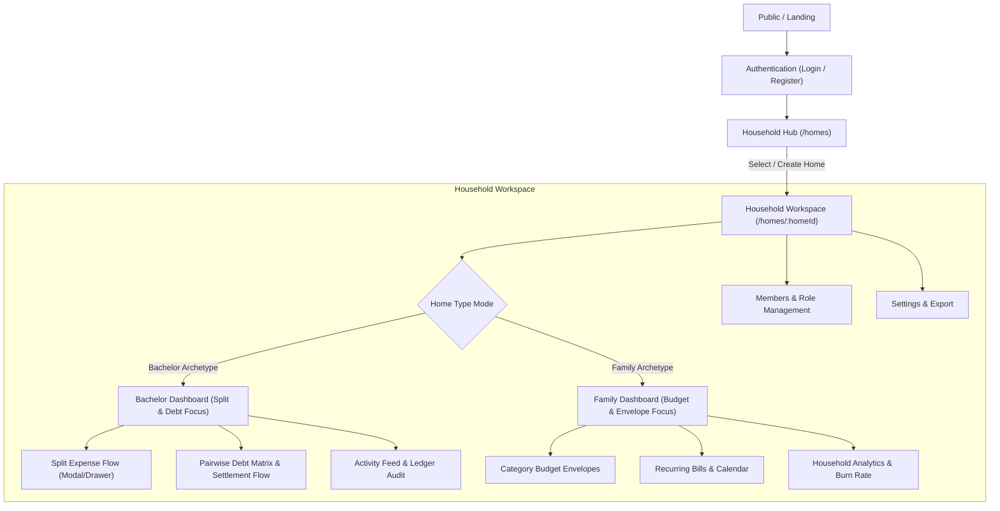

# Equilibrium Household — Screen Map & Information Architecture
**Product:** HomeExpense  
**Phase:** Phase 2 (Elite UI/UX + Design System)  
**Status:** Approved & Implemented  
**Scope:** Complete Screen Flow and View Specifications

---

## 1. Global Navigation Architecture

The HomeExpense application flows through three primary states: Public/Authentication, Multi-Tenant Home Hub, and Household Workspace (with adaptive Bachelor vs. Family mode layouts).

---

## 2. Complete Screen Inventory & UX Specifications

### 2.1 Public & Authentication
| Screen ID | Route | Screen Name | Key Elements & Equilibrium Patterns |
| :--- | :--- | :--- | :--- |
| **SCR-01** | `/` (Unauth) | **Public Landing** | Editorial headline, high-level value prop (zero balance drift, dual-mode), CTA to Sign In / Register. |
| **SCR-02** | `/login` | **Sign In** | Crisp surface card (`#ffffff`), email/password inputs, obsidian pill submit button, inline error banner with terracotta outline. |
| **SCR-03** | `/register` | **Account Creation** | Full name, email, password strength indicator, fast onboarding redirect into Homes Hub. |
| **SCR-04** | `/forgot-password` | **Password Reset** | Calm single-input email recovery with time-limited cryptographic token link. |

---

### 2.2 Household Hub & Creation
| Screen ID | Route | Screen Name | Key Elements & Equilibrium Patterns |
| :--- | :--- | :--- | :--- |
| **SCR-05** | `/` (Auth) | **Homes Hub** | Grid of user's active households, Bachelor vs. Family archetype pills, active user role badge, quick creation modal trigger. |
| **SCR-06** | Modal on `/` | **Create Household Modal** | Name, archetype picker (Bachelor / Family with iconography & description), currency dropdown (INR, USD, EUR, GBP), description notes. |

---

### 2.3 Core Household Dashboards (Dual-Mode)
| Screen ID | Route | Screen Name | Key Elements & Equilibrium Patterns |
| :--- | :--- | :--- | :--- |
| **SCR-07A** | `/homes/:homeId` | **Bachelor Dashboard** | Sticky header with Mode pill ("Bachelor Mode"), Ledger status pill ("USD • Ledger Balanced"), Net balance card (You owe / You are owed), Pairwise debt matrix, Recent transactions feed. |
| **SCR-07B** | `/homes/:homeId` | **Family Dashboard** | Sticky header with Mode pill ("Family Mode"), Total pooled monthly spend, Category budget envelopes with hairline progress meters, Upcoming bills due in next 7 days, Recent expenses. |

---

### 2.4 Expense Creation & Split Configuration
| Screen ID | Route | Screen Name | Key Elements & Equilibrium Patterns |
| :--- | :--- | :--- | :--- |
| **SCR-08** | Inset/Drawer | **Hero Expense Entry** | Hero Amount Card (`font-numeric-hero` 40px tabular input), Currency indicator, Description input, Quick category chips (Groceries, Utilities, Dining, Household, Maintenance). |
| **SCR-09** | Inset/Drawer | **Payer Selector Rail** | Horizontal avatar list of household members with active checkmark badge and clear visual attribution of fronted capital. |
| **SCR-10** | Inset/Drawer | **Segmented Split Mode Rail** | 4-mode toggle: `Equal`, `Exact`, `% Pct`, `Shares`. Live feedback callout displaying per-person quota and remainder cent absorption rule. |
| **SCR-11** | Inset/Drawer | **Participant Breakdown List** | Checkbox toggles for participation, editable inputs (for Exact, %, Shares), auto-calculated monetary share in tabular numerals, remainder absorption indicator badge. |
| **SCR-12** | Inset/Drawer | **Arithmetic Integrity Banner** | Real-time visual progress bar verifying 100% allocation, evergreen checkmark when balanced, terracotta error when under/over-allocated. Sticky submission button. |

---

### 2.5 Debts, Settlements & Balances
| Screen ID | Route | Screen Name | Key Elements & Equilibrium Patterns |
| :--- | :--- | :--- | :--- |
| **SCR-13** | `/homes/:id?tab=debts` | **Pairwise Debt Matrix** | Visual matrix or cards detailing bilateral obligations between roommates with tabular amounts. |
| **SCR-14** | Modal | **Record Settlement Flow** | Payer, Payee, Settlement amount input, Payment method (Cash, UPI, Venmo, Bank Transfer), optional reference notes / receipt attachment, immediate ledger reconciliation. |

---

### 2.6 Family Envelopes, Bills & Recurring
| Screen ID | Route | Screen Name | Key Elements & Equilibrium Patterns |
| :--- | :--- | :--- | :--- |
| **SCR-15** | `/homes/:id?tab=envelopes` | **Budget Envelopes View** | Monthly allocation per category, spent vs. remaining tabular figures, status indicators (Surplus, Warning, Depleted). |
| **SCR-16** | `/homes/:id/bills` | **Recurring Bills & Calendar** | List of scheduled bills (Rent, Internet, Electricity), interval selector (Monthly, Quarterly, Annual), split rule assignment, due date alerts. |

---

### 2.7 Management, Analytics & Governance
| Screen ID | Route | Screen Name | Key Elements & Equilibrium Patterns |
| :--- | :--- | :--- | :--- |
| **SCR-17** | `/homes/:id/members` | **Members & Roles** | Member directory, Role badges (Owner, Admin, Member, Guest), invite links / email invites, individual spending caps. |
| **SCR-18** | `/homes/:id/analytics` | **Analytics & Burn Rate** | Monthly expenditure trajectory, category breakdown donut/bars, member share comparison, export to CSV/JSON. |
| **SCR-19** | `/homes/:id/audit` | **Activity & Audit Log** | Immutable chronological record of every expense added, modified, split adjusted, or settled with author and timestamp. |
| **SCR-20** | `/settings` | **Household & Profile Settings** | Default currency, notifications, mode toggle (Bachelor $\leftrightarrow$ Family transition), dark/light mode preference, account security. |

---

## 3. Responsive Breakpoints & Device Adaptations

1. **Mobile (< 640px):**
   - Single-column vertical flow.
   - Payer selector collapses to a horizontal scrollable rail.
   - Hero Amount card occupies full screen width with 44px minimum touch targets.
   - Primary action buttons pin as a sticky floating bottom bar.
2. **Tablet / Desktop (640px - 1024px+):**
   - Two-column split layout: Left column contains expense entry and payer selection; right column displays live split preview, participant cards, and allocation proof.
   - Transaction feeds display extended metadata (audit timestamp, entry author, category tags).
