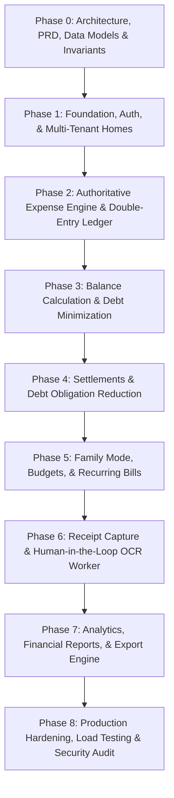

# Development Strategy & Phase Dependency Graph
## HomeExpense — Execution Roadmap & Milestone Gating

**Document Version:** 1.0.0  

---

## 1. Phase Dependency Graph

---

## 2. Implementation Vertical Slices

### Phase 1: Identity & Multi-Tenant Foundations
* **Scope:** Registration, login, session tokens, Home creation (Bachelor/Family), member invitations, RBAC guards.
* **Gate Check:** Able to register 3 users, create a home, invite users, and confirm role permissions server-side.

### Phase 2: Core Financial Events & Ledger Engine
* **Scope:** Expense mutations, split calculators (Equal, Percentage, Shares, Exact), cents precision, double-entry `ledger_entries` creation.
* **Gate Check:** 100% invariant verification: $\sum \text{Splits} = \text{Expense Amount}$, non-payers correctly assigned as debtors.

### Phase 3: Dynamic Balances & Debt Minimization
* **Scope:** SQL ledger aggregation, net balances, direct pairwise obligations matrix, bipartite debt simplification (`simplifyDebts`).
* **Gate Check:** Zero-sum invariant passes: $\sum \text{Net Balances} = 0.00$.

### Phase 4: Settle Up Flow & Ledger Offsets
* **Scope:** Settlement recording, bounds validation against outstanding debt, counterbalancing ledger entries.
* **Gate Check:** Net obligation reduces deterministically upon settlement; cannot settle $> \text{debt}$.

### Phase 5: Household Planning & Domestic Bills
* **Scope:** Monthly budget envelopes, category spending caps, bill tracking, due-date reminders.

### Phase 6: Receipt Staging & OCR Pipeline
* **Scope:** Pre-signed S3 uploads, BullMQ queue, OCR extraction worker, side-by-side human verification modal.
* **Gate Check:** Zero automated financial mutations from AI without explicit user confirmation.

### Phase 7: Analytics & Compliance Exports
* **Scope:** Monthly category rollups, spending trendlines, signed CSV/PDF audit export.

### Phase 8: Hardening, SRE & Production Deployment
* **Scope:** Rate limiting verification, penetration testing, load testing (1,000 concurrent split calculations), CI/CD automated deployment.
